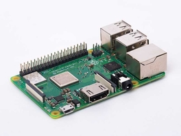

#### Pi 3 B+ Config for use as a Network Tap 


#### Usage
Add a [USB Ethernet Adapter](https://www.amazon.com/gp/product/B00FFJ0RKE/) to the pi and setup the pi w/the included configs.

(Optional) To test out Monitor Mode cracking WPA2, try the [PAU05 USB Wifi Adapter](https://www.amazon.com/Panda-300Mbps-Wireless-USB-Adapter/dp/B00EQT0YK2)

Edit to your system specifics as needed:
- etc_dhcpcd.conf
- etc_network_interfaces
- etc_wpa_supplicant_wpa_supplicant.conf

(others are optional)


#### Expectations
The PI will sit between your Cable Modem and Wireless Router using a [Linux Ethernet Bridge](http://www.microhowto.info/howto/bridge_traffic_between_two_or_more_ethernet_interfaces_on_linux.html):

```
+-------------------+
|                   |
|    Cable Modem    |
|                   |
+----+--------------+
     |
     |
     |
     +<------------------Eth0 (No IP)--+
     |
     +-------+
     |       |
     | Pi    |
     |       |
     |Wlan0/1|..XXXX..XXXX...Wifi Signal.....XX..XX.XX
     +------++                                    XX
          |                                     XX
          +<-------------Eth1 (No IP)--+       XX
          |                                  XX
      +---+---------------------------+    XX
      |  (DMZ port has the ISP IP)    |   XX
      |                               |  XX
      |  Wirleless Router             |XX
      |                               |
      |  (internal ports)             |
      +-------------------------------+
         |
         |
        +------------------------+
        | Internal wired pc, etc.|
        +------------------------+

```

This can be an alternate deployment than the one at [BriarIDS](https://github.com/musicmancorley/BriarIDS/wiki/Deployment-Instructions)

In this config you'll have both Ethernet ports without an IP (ifconfig output below), but have the PI be accessible via ssh through the local wireless AP for admin access with ssh (via wlan0). 

You can tryout BriarIDS as mentioned or go on your on using any of Suricata, Bro, Snort, etc.

#### Dependencies 
apt-get install bridge-utils

#### ifconfig

```
root@raspberrypi:~# ifconfig 
br0: flags=4163<UP,BROADCAST,RUNNING,MULTICAST>  mtu 1500
        inet6 fe80::3e8c:f8ff:feff:8e00  prefixlen 64  scopeid 0x20<link>
        ether 3c:8c:f8:ff:8e:00  txqueuelen 1000  (Ethernet)
        RX packets 22107  bytes 1068562 (1.0 MiB)
        RX errors 0  dropped 0  overruns 0  frame 0
        TX packets 11  bytes 1351 (1.3 KiB)
        TX errors 0  dropped 0 overruns 0  carrier 0  collisions 0

eth0: flags=4163<UP,BROADCAST,RUNNING,MULTICAST>  mtu 1500
        ether b8:27:eb:11:05:34  txqueuelen 1000  (Ethernet)
        RX packets 17508  bytes 2571023 (2.4 MiB)
        RX errors 0  dropped 0  overruns 0  frame 0
        TX packets 47682  bytes 32936855 (31.4 MiB)
        TX errors 0  dropped 0 overruns 0  carrier 0  collisions 0

eth1: flags=4163<UP,BROADCAST,RUNNING,MULTICAST>  mtu 1500
        ether 3c:8c:f8:ff:8e:00  txqueuelen 1000  (Ethernet)
        RX packets 47683  bytes 32268840 (30.7 MiB)
        RX errors 3  dropped 0  overruns 0  frame 3
        TX packets 17507  bytes 2709586 (2.5 MiB)
        TX errors 0  dropped 0 overruns 0  carrier 0  collisions 0

lo: flags=73<UP,LOOPBACK,RUNNING>  mtu 65536
        inet 127.0.0.1  netmask 255.0.0.0
        inet6 ::1  prefixlen 128  scopeid 0x10<host>
        loop  txqueuelen 1000  (Local Loopback)
        RX packets 0  bytes 0 (0.0 B)
        RX errors 0  dropped 0  overruns 0  frame 0
        TX packets 0  bytes 0 (0.0 B)
        TX errors 0  dropped 0 overruns 0  carrier 0  collisions 0

wlan0: flags=4163<UP,BROADCAST,RUNNING,MULTICAST>  mtu 1500
        inet 192.168.0.199  netmask 255.255.255.0  broadcast 192.168.0.255
        inet6 fe80::d3b1:d50b:a9c0:d153  prefixlen 64  scopeid 0x20<link>
        ether b8:27:eb:44:50:61  txqueuelen 1000  (Ethernet)
        RX packets 389  bytes 108496 (105.9 KiB)
        RX errors 0  dropped 0  overruns 0  frame 0
        TX packets 244  bytes 42320 (41.3 KiB)
        TX errors 0  dropped 0 overruns 0  carrier 0  collisions 0

wlan1: flags=4163<UP,BROADCAST,RUNNING,MULTICAST>  mtu 1500
        unspec 9C-EF-D5-FC-36-F4-30-30-00-00-00-00-00-00-00-00  txqueuelen 1000  (UNSPEC)
        RX packets 32786  bytes 8236811 (7.8 MiB)
        RX errors 0  dropped 0  overruns 0  frame 0
        TX packets 0  bytes 0 (0.0 B)
        TX errors 0  dropped 0 overruns 0  carrier 0  collisions 0

```

#### Extra Fun
Install the [DataPlicity](https://www.dataplicity.com) client and connect to your PI from anywhere.

#### Fancy Images By  ####
[http://asciiflow.com/](http://asciiflow.com/)
