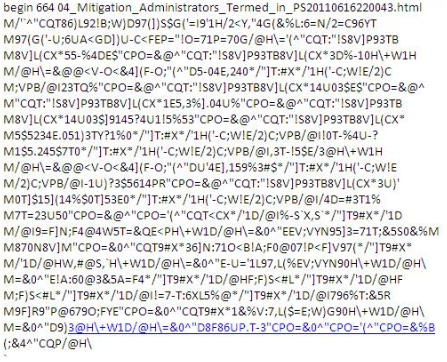

#### uuencode-py
Encode and decode uuencoded file using a mapping of your choosing (pentest,etc).

 (Pic courtesy of Microsoft)


#### Usage
```
./uu2hello.py UUENCODED_FILE.UUE (creates UUENCODED_FILE.uue.hello)
```

Send it somewhere...

```
./hello2uu.py UUENCODED_FILE.UUE.hello (creates UUENCODED_FILE.uue.hello.uue)
```
#### Expectations
- The original .uue file will differ from the final decoded UUENCODED_FILE.uue.hello.uue as it does not take the final name with it as that would be undesirable (if sent via an unencrypted transport)
- The final decoded file will always be named test.text.tar for privacy
- A mapping of special characters to certain "Hello" values was chosen; this could be changed


#### Examples
Take a .uue file, convert it and then convert back using the included 'test_uu.sh' (diffs are shown)

```
ls -ltR > file.txt
./test_uu.sh  file.txt 
5782f2802458eb7a42d1c0ee2e2b7ac45b75d45aea4fe57e4d2a541d7a8e35b3  file.txt
7b32140282bd55c158bef75ca0174a658ba04793f6190a5d29ee527d8947ac1f  file.txt.uue
35d94c1bdd7f719f43d164e4273240bd3b0d116494e34c2d1bbc6a6b3c6d2c6a  file.txt.uue.hello.uue
1c1
< begin 664 file.txt
---
> begin 664 test.text.tar

```
The files differ only by the inital unix file name line.
